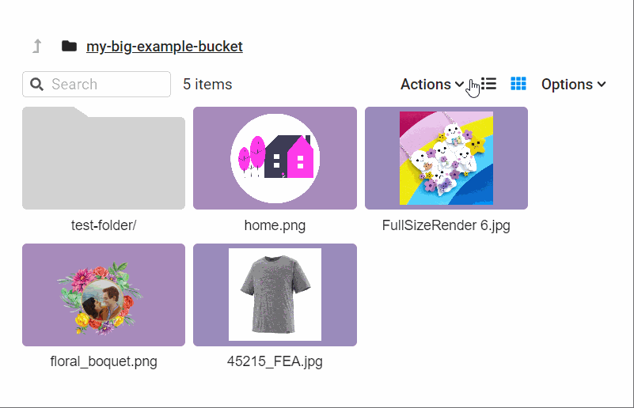

# s3-bucket-browser

The s3-bucket-browser is a file browser for private S3 buckets, built with Vite, React, and Node, using Chonky. 


## Prerequisites:
Before using this project, you need to create a user with read and list permissions for the bucket you wish to browse. Create an access key for the user and make a copy of the Access Key ID and the Secret Access Key.

## Installation:
You can clone the git repository by running the following command:
```
https://github.com/theodore-q/s3-bucket-browser.git
cd s3-bucket-browser
```

## Starting the backend::
First, navigate to the backend folder with the command `cd ./backend`. Create an .env file with the following details and save it to the backend folder:
```
ACCESS_KEY_ID = XXXXXXXXXXXXXXXXXXX
SECRET_ACCESS_KEY = XXXXXXXXXXXXXXXXXXXXXXXXXXXXXXXXXXXXXX
BUCKET_REGION = eu-west-1
```
Then, run the following commands inside the backend folder to start the backend:

```
npm install
npm run start dev
```
The backend should be up and running.


## Starting the frontend:

In a new terminal, navigate to the root folder of the project. Create an .env file with the following details:
```
BACKEND_URL = http://localhost:3010
BUCKET_NAME = my-big-example-bucket
```
Finally, run the command `npm run dev` to start the frontend.

Your app will now be avalible at: http://localhost:3010

Extending the task:
If I were to spend more time, I would the task by adding features such as:
 - Unit tests for individual functions
 - Integration tests for API endpoints
 - Auto generating thumbnails
 - The ability to switch bucket in the browser
 - Implement pagination for listing large numbers of files in a bucket


